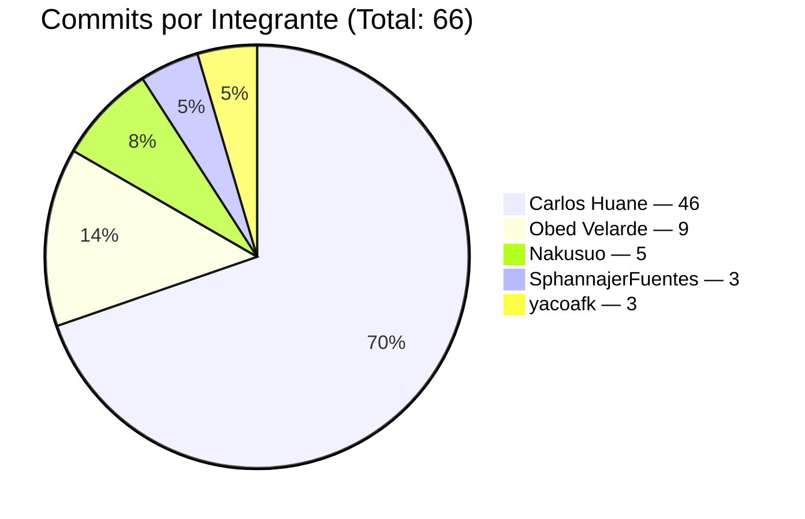
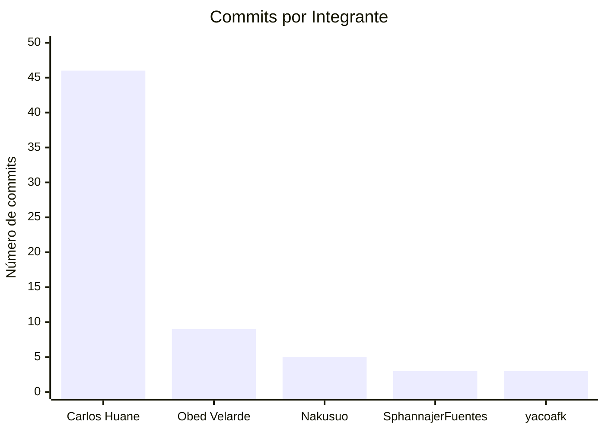
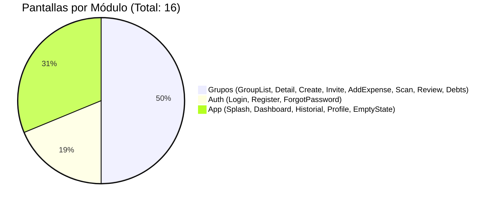
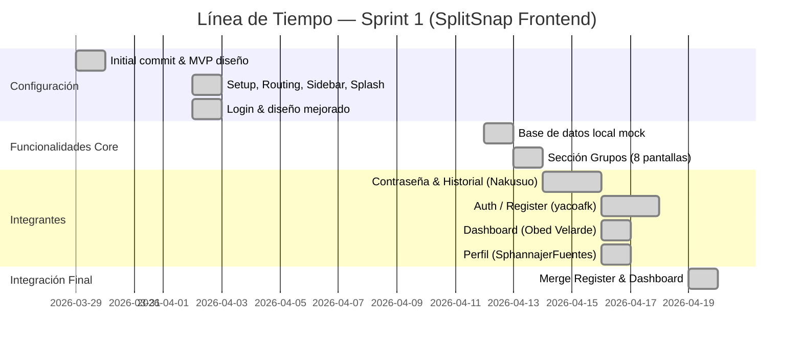

# SplitSnap — Frontend

> Aplicación web para dividir gastos entre grupos, construida en React + Vite.

---

## Enlaces del Proyecto

| Recurso | Enlace |
|---------|--------|
| Diseño UI | [Figma — SplitSnap](https://www.figma.com/design/cQIWPo5Q8xUltYI0csHZ6q/Pencil-to-Figma-Importer--Comunidad-?node-id=1-1892&t=MDs1X9QVeJqjXc6H-1) |
| Product Backlog y Requerimientos | [Google Docs](https://docs.google.com/document/d/1zwfa7n6_puNALHguFup8Qa2poQH24fvr/edit?usp=sharing&ouid=115107241775214727274&rtpof=true&sd=true) |
| Gestión de Tareas | [Jira — SplitSnap](https://carloshuanesarmiento.atlassian.net/jira/software/projects/SCRUM/boards/1?atlOrigin=eyJpIjoiYzIyNjJjMTBlOTM4NGQ4MmI1YjdmZGU0YjMwMDUzYWMiLCJwIjoiaiJ9) |
| Repositorio Frontend | [GitHub — SplitSnap](https://github.com/Carlos-Huane/SplitSnap-) |

---

## Tabla de Contenidos

1. [Descripción General](#1-descripción-general)
2. [Integrantes del Equipo](#2-integrantes-del-equipo)
3. [Stack Tecnológico](#3-stack-tecnológico)
4. [Estructura del Proyecto](#4-estructura-del-proyecto)
5. [Ramas (Branches)](#5-ramas-branches)
6. [Línea de Tiempo del Desarrollo](#6-línea-de-tiempo-del-desarrollo)
7. [Pull Requests Fusionados](#7-pull-requests-fusionados)
8. [Historial de Commits](#8-historial-de-commits)
9. [Arquitectura de la Aplicación](#9-arquitectura-de-la-aplicación)
10. [Rutas de la Aplicación](#10-rutas-de-la-aplicación)
11. [Capa de Datos Mock](#11-capa-de-datos-mock)
12. [Convenciones del Proyecto](#12-convenciones-del-proyecto)
13. [Cómo Ejecutar el Proyecto](#13-cómo-ejecutar-el-proyecto)

---

## 1. Descripción General

**SplitSnap** es una aplicación frontend desarrollada en React que permite a grupos de personas dividir y gestionar gastos compartidos. Entre sus funcionalidades principales se encuentran:

- Autenticación de usuarios (login, registro, recuperación de contraseña)
- Creación y gestión de grupos de gasto
- Escaneo de recibos mediante OCR
- División de gastos entre miembros
- Resumen de deudas por persona y por gasto
- Dashboard con actividad reciente
- Historial de transacciones
- Gestión de perfil de usuario

La aplicación consume una **capa de datos mock** local (sin backend real) durante el Sprint 1, diseñada para ser reemplazada de manera transparente por llamadas a una API REST en el Sprint 2.

---

## 2. Integrantes del Equipo

| # | Nombre | GitHub / Email | Rol | Commits |
|---|--------|----------------|-----|---------|
| 1 | **Carlos Huane** | `carloshuanesarmiento@gmail.com` | PM / Lead Developer | 46 |
| 2 | **Obed Velarde** | `U23225009@utp.edu.pe` | Dashboard | 9 |
| 3 | **Nakusuo** | GitHub: `Nakusuo` | Contraseña / Historial | 5 |
| 4 | **SphannajerFuentes** | `sphannajerfuentes@gmail.com` | Perfil | 3 |
| 5 | **yacoafk** | `yormancamposortiz713@gmail.com` | Auth / Register | 3 |

**Total de commits:** 66

### Distribución de commits por integrante





---

## 3. Stack Tecnológico

| Herramienta | Versión | Uso |
|-------------|---------|-----|
| React | ^19.2.4 | Librería de UI principal |
| React DOM | ^19.2.4 | Renderizado en el navegador |
| React Router DOM | ^7.13.2 | Enrutamiento SPA |
| Vite | ^8.0.1 | Bundler y servidor de desarrollo |
| ESLint | ^9.39.4 | Linter de código |
| eslint-plugin-react-hooks | ^7.0.1 | Reglas de hooks de React |
| eslint-plugin-react-refresh | ^0.5.2 | Fast Refresh en desarrollo |

**Lenguaje:** JavaScript (JSX)  
**Estilos:** CSS plano con variables CSS personalizadas (sin frameworks de UI)  
**Persistencia:** `localStorage` (clave `splitsnap_v1`) durante el Sprint 1

### Distribución de pantallas por módulo



---

## 4. Estructura del Proyecto

```
splitsnap-frontend/
├── public/
├── src/
│   ├── assets/                  # Imágenes y recursos estáticos
│   │
│   ├── components/
│   │   ├── dashboard/
│   │   │   └── ActivityItem.jsx  # Ítem de actividad reciente
│   │   └── shared/
│   │       ├── Sidebar.jsx       # Navegación lateral global
│   │       └── Sidebar.css
│   │
│   ├── context/
│   │   ├── AppContext.jsx        # Estado global (grupos, gastos, deudas)
│   │   └── SidebarContext.jsx    # Estado de apertura del sidebar
│   │
│   ├── data/                    # Capa de datos mock (Sprint 1)
│   │   ├── README.md
│   │   ├── global.js            # Usuarios y categorías compartidas
│   │   ├── auth.js              # Datos de autenticación
│   │   ├── dashboard.js         # Datos del dashboard
│   │   ├── groups.js            # Grupos y gastos
│   │   ├── historial.js         # Historial de transacciones
│   │   ├── profile.js           # Perfil de usuario
│   │   └── index.js             # Re-exports centralizados
│   │
│   ├── pages/                   # Una página = una ruta
│   │   ├── Splash.jsx / .css
│   │   ├── Login.jsx / .css
│   │   ├── Register.jsx / .css
│   │   ├── ForgotPassword.jsx / .css
│   │   ├── Dashboard.jsx
│   │   ├── GroupList.jsx / .css
│   │   ├── GroupDetail.jsx / .css
│   │   ├── CreateGroup.jsx / .css
│   │   ├── InviteMembers.jsx / .css
│   │   ├── AddExpense.jsx / .css
│   │   ├── ScanReceipt.jsx / .css
│   │   ├── ReviewItems.jsx / .css
│   │   ├── DebtSummary.jsx / .css
│   │   ├── Historial.jsx / .css
│   │   ├── Profile.jsx / .css
│   │   └── EmptyState.jsx / .css
│   │
│   ├── styles/
│   │   ├── variables.css        # Variables CSS globales (colores, tipografía)
│   │   ├── global.css           # Reset y estilos base
│   │   └── dashboard.css        # Estilos específicos del dashboard
│   │
│   ├── App.jsx                  # Árbol de rutas principal
│   ├── main.jsx                 # Punto de entrada
│   └── index.css
│
├── README.md
├── package.json
├── vite.config.js
└── eslint.config.js
```

---

## 5. Ramas (Branches)

### Ramas activas en el repositorio remoto

| Rama | Propósito | Estado |
|------|-----------|--------|
| `main` | Rama de producción estable | Activa |
| `develop` | Rama de integración del equipo | Activa (rama principal de trabajo) |
| `feat/base-datos-local-js` | Capa de datos mock | Fusionada en develop (PR #7) |
| `feat/contraseña-section` | Pantalla de cambio de contraseña | Fusionada en develop (PR #10) |
| `feat/dashboard` | Dashboard completo y responsivo | Fusionada en develop (PR #16) |
| `feat/groups-section` | Sección completa de grupos | Fusionada en develop (PR #8) |
| `feat/historial-section` | Sección de historial | Fusionada en develop (PR #11) |
| `feat/perfil-section` | Sección de perfil de usuario | Fusionada en develop (PR #15) |
| `feat/register` | Lógica de registro e inicio de sesión | Fusionada en develop (PR #14) |

### Ramas históricas (ya eliminadas / fusionadas)

| Rama | Propósito | PR |
|------|-----------|-----|
| `feature/project-setup` | Configuración inicial del proyecto | #1 |
| `feature/routing` | Configuración de rutas con React Router | #2 |
| `feature/sidebar` | Componente Sidebar con navegación | #3 |
| `feature/splash-screen` | Pantalla Splash con animación | #4 |
| `design/diseño-mejorado` | Mejoras visuales y pantalla Login | #5 |
| `feat/breve-documentacion` | Documentación inicial del proyecto | #6 |

---

## 6. Línea de Tiempo del Desarrollo



## 7. Pull Requests Fusionados

| PR | Rama origen | Fecha | Descripción |
|----|-------------|-------|-------------|
| #1 | `feature/project-setup` | 2026-04-02 | Configuración inicial: estructura de carpetas, limpieza de template Vite, variables CSS |
| #2 | `feature/routing` | 2026-04-02 | Configuración de React Router con todas las rutas y placeholders de páginas |
| #3 | `feature/sidebar` | 2026-04-02 | Componente Sidebar con navegación e integración en el layout principal |
| #4 | `feature/splash-screen` | 2026-04-02 | Pantalla Splash con animación de entrada |
| #5 | `design/diseño-mejorado` | 2026-04-02 | Diseño mejorado general y pantalla de Login completa |
| #6 | `feat/breve-documentacion` | 2026-04-02 | Documentación interna del proyecto |
| #7 | `feat/base-datos-local-js` | 2026-04-12 | Base de datos local mock para integraciones JS |
| #8 | `feat/groups-section` | 2026-04-13 | Sección completa de grupos con estado global y flujo funcional |
| #10 | `feat/contraseña-section` | 2026-04-16 | Pantalla de cambio/recuperación de contraseña |
| #11 | `feat/historial-section` | 2026-04-16 | Sección de historial de transacciones |
| #14 | `feat/register` | 2026-04-19 | Lógica de registro e inicio de sesión con credenciales locales |
| #15 | `feat/perfil-section` | 2026-04-16 | Sección de perfil diseñada y responsiva con interacciones |
| #16 | `feat/dashboard` | 2026-04-19 | Dashboard completo con datos dinámicos y diseño responsivo |

---

## 8. Historial de Commits

| Hash | Autor | Fecha | Mensaje |
|------|-------|-------|---------|
| `66edb6a` | Carlos Huane | 2026-04-19 | Merge pull request #16 from Carlos-Huane/feat/dashboard |
| `1ce261c` | Carlos Huane | 2026-04-19 | Merge pull request #14 from Carlos-Huane/feat/register |
| `1aa89ec` | Carlos Huane | 2026-04-19 | Merge branch 'develop' into feat/register |
| `62e21b0` | yacoafk | 2026-04-18 | logica de register implementada para funcionar de manera local |
| `d5d8f43` | Obed Velarde | 2026-04-18 | fix: resolver conflicto en package-lock.json |
| `b93f061` | yacoafk | 2026-04-17 | desarrollo de la logica de login para usar credenciales locales |
| `879b2a1` | Carlos Huane | 2026-04-16 | Merge pull request #15 from Carlos-Huane/feat/perfil-section |
| `eaf23e4` | SphannajerFuentes | 2026-04-16 | Integrando interacciones en Perfil |
| `4814d87` | SphannajerFuentes | 2026-04-16 | Pagina Perfil diseñado y responsivo |
| `9dabd85` | SphannajerFuentes | 2026-04-16 | Campos especificados de Perfil |
| `298f10a` | Carlos Huane | 2026-04-16 | Merge pull request #11 from Carlos-Huane/feat/historial-section |
| `7e76731` | Carlos Huane | 2026-04-16 | Merge pull request #10 from Carlos-Huane/feat/contraseña-section |
| `0aa0363` | yacoafk | 2026-04-16 | register desarrollado |
| `952f957` | Nakusuo | 2026-04-16 | cambios ligeros en diseño |
| `8bc6f23` | Obed Velarde | 2026-04-16 | feat: agregar mas actividades al dashboard |
| `73e645a` | Obed Velarde | 2026-04-16 | fix: usar usuario dinamico y ajustar layout dashboard full width |
| `c2c0b86` | Obed Velarde | 2026-04-16 | refactor: separar componente ActivityItem y mejorar estructura dashboard |
| `27d0036` | Obed Velarde | 2026-04-16 | feat: responsive layout para web dashboard |
| `572348d` | Obed Velarde | 2026-04-16 | feat: integrar datos dinamicos en dashboard |
| `9a60e3e` | Obed Velarde | 2026-04-16 | fix: mejorar alineacion header en mobile |
| `5729a50` | Obed Velarde | 2026-04-16 | Pantalla Dashboard : Diseño Movil |
| `c829453` | Obed Velarde | 2026-04-16 | dashboard mobile: estructura inicial |
| `9d56036` | Nakusuo | 2026-04-15 | mejora del responsive de contraseña login |
| `551f2f1` | Nakusuo | 2026-04-15 | mejora del responsive de contraseña login |
| `0281497` | Nakusuo | 2026-04-15 | creacion de cambio de contraseña login |
| `afd7553` | Nakusuo | 2026-04-14 | mejora en responsive version movil |
| `41ee627` | Carlos Huane | 2026-04-13 | Merge pull request #8 from Carlos-Huane/feat/groups-section |
| `430eb19` | Carlos Huane | 2026-04-13 | feat: rediseño de resumen de deudas con agrupación por gasto y por persona |
| `7ccd220` | Carlos Huane | 2026-04-13 | fix: reemplazar botón Nuevo Grupo del sidebar por Cerrar Sesión |
| `3b8ba31` | Carlos Huane | 2026-04-13 | feat: integración completa de estado global y flujo funcional en Mis Grupos |
| `c9a856b` | Carlos Huane | 2026-04-13 | fix: layout dos columnas en desktop para DebtSummary |
| `bfdc3d9` | Carlos Huane | 2026-04-13 | fix: avatares superpuestos y panel resumen en desktop para ReviewItems |
| `f6a4606` | Carlos Huane | 2026-04-13 | fix: centrar AddExpense en desktop y eliminar sección de categorías |
| `12c8bb3` | Carlos Huane | 2026-04-13 | feat: implementar pantalla Resumen de Deudas con integración JS |
| `7b8200d` | Carlos Huane | 2026-04-13 | feat: implementar pantalla Revisar Items del recibo |
| `720c845` | Carlos Huane | 2026-04-13 | feat: implementar pantalla Escanear Recibo (OCR) |
| `bc872de` | Carlos Huane | 2026-04-13 | feat: implementar pantalla Agregar Gasto Manual |
| `8539ca5` | Carlos Huane | 2026-04-13 | feat: implementar pantalla Detalle de Grupo |
| `314eeb8` | Carlos Huane | 2026-04-13 | feat: implementar pantalla Invitar Miembros |
| `8303e0b` | Carlos Huane | 2026-04-13 | refactor: integrar estado vacío dentro de GroupList |
| `dceab60` | Carlos Huane | 2026-04-13 | feat: implementar pantalla Crear Grupo |
| `48aa639` | Carlos Huane | 2026-04-13 | feat: implementar pantalla Estado Vacío para grupos |
| `d91b943` | Carlos Huane | 2026-04-13 | feat: implementar pantalla Mis Grupos con lista de grupos |
| `8fc4d14` | Carlos Huane | 2026-04-12 | Merge pull request #7 from Carlos-Huane/feat/base-datos-local-js |
| `dbe8326` | Carlos Huane | 2026-04-12 | feat: base de datos local para integraciones js |
| `f8fff3a` | Carlos Huane | 2026-04-02 | Merge pull request #6 from Carlos-Huane/feat/breve-documentacion |
| `1199005` | Carlos Huane | 2026-04-02 | feat: breve documentación |
| `1030aeb` | Carlos Huane | 2026-04-02 | Merge pull request #5 from Carlos-Huane/design/diseño-mejorado |
| `8884d97` | Carlos Huane | 2026-04-02 | feat: diseño mejorado |
| `eaa0c96` | Carlos Huane | 2026-04-02 | feat: implementar pantalla de Login |
| `949d12d` | Carlos Huane | 2026-04-02 | Merge pull request #4 from Carlos-Huane/feature/splash-screen |
| `be6e5c4` | Carlos Huane | 2026-04-02 | Merge pull request #3 from Carlos-Huane/feature/sidebar |
| `713f9df` | Carlos Huane | 2026-04-02 | Merge pull request #2 from Carlos-Huane/feature/routing |
| `7e42278` | Carlos Huane | 2026-04-02 | feat: implementar pantalla Splash con animación |
| `2d6ee1f` | Carlos Huane | 2026-04-02 | feat: integrar Sidebar en layout principal |
| `4d56e97` | Carlos Huane | 2026-04-02 | feat: crear componente Sidebar con navegación |
| `12516f0` | Carlos Huane | 2026-04-02 | feat: configurar React Router con todas las rutas |
| `9d4e07c` | Carlos Huane | 2026-04-02 | feat: crear componentes placeholder de todas las páginas |
| `c98f33c` | Carlos Huane | 2026-04-02 | Merge pull request #1 from Carlos-Huane/feature/project-setup |
| `10b154b` | Carlos Huane | 2026-04-02 | chore: crear estructura de carpetas del proyecto |
| `282192c` | Carlos Huane | 2026-04-02 | chore: limpiar estilos template de Vite |
| `34cb551` | Carlos Huane | 2026-04-02 | feat: agregar variables CSS y estilos globales |
| `1c0670e` | Carlos Huane | 2026-03-30 | feat: diseño básico de mvp, tanto front end como back end |
| `31b5016` | Carlos Huane | 2026-03-30 | feat: agregar mvp diseño |
| `988254b` | Carlos Huane | 2026-03-29 | feat: configuración inicial de react |
| `a089f28` | Carlos Huane | 2026-03-29 | Initial commit |

---

## 9. Arquitectura de la Aplicación

### Gestión de Estado Global — `AppContext`

El estado de la aplicación se gestiona con `useReducer` + `Context API` y se persiste automáticamente en `localStorage` bajo la clave `splitsnap_v1`.

**Estado global:**
```js
{
  groups: [],    // Grupos creados por el usuario
  expenses: [],  // Gastos registrados
  debts: [],     // Deudas generadas a partir de los gastos
}
```

**Acciones disponibles:**

| Acción | Descripción |
|--------|-------------|
| `ADD_GROUP` | Agrega un nuevo grupo al estado |
| `ADD_EXPENSE` | Registra un gasto y genera deudas automáticamente |
| `MARK_DEBT_PAID` | Marca una deuda como pagada |
| `ADD_MEMBER_TO_GROUP` | Agrega un miembro a un grupo existente |

**Helpers exportados:**
- `genId(prefix)` — Genera IDs únicos con formato `prefix-timestamp-random`
- `buildDebts(expense)` — Calcula automáticamente las deudas a partir de un gasto dividido

### Gestión del Sidebar — `SidebarContext`

Controla el estado de apertura/cierre del sidebar lateral en dispositivos móviles.

```js
{ isOpen, toggleSidebar, closeSidebar }
```

### Árbol de Providers

```jsx
<AppProvider>           // Estado global (grupos, gastos, deudas)
  <SidebarProvider>     // Control del sidebar móvil
    <AppRoutes />       // Árbol de rutas con React Router
  </SidebarProvider>
</AppProvider>
```

---

## 10. Rutas de la Aplicación

| Ruta | Componente | Sidebar | Descripción |
|------|-----------|---------|-------------|
| `/` | `Splash` | No | Pantalla de bienvenida con animación |
| `/login` | `Login` | No | Inicio de sesión |
| `/register` | `Register` | No | Registro de nuevo usuario |
| `/forgot-password` | `ForgotPassword` | No | Recuperación / cambio de contraseña |
| `/dashboard` | `Dashboard` | Sí | Panel principal con resumen y actividad |
| `/groups` | `GroupList` | Sí | Lista de grupos del usuario |
| `/groups/new` | `CreateGroup` | Sí | Crear un nuevo grupo |
| `/groups/:id` | `GroupDetail` | Sí | Detalle de un grupo específico |
| `/groups/:id/invite` | `InviteMembers` | Sí | Invitar miembros al grupo |
| `/groups/:id/add-expense` | `AddExpense` | Sí | Agregar gasto manual |
| `/groups/:id/scan` | `ScanReceipt` | Sí | Escanear recibo (OCR) |
| `/groups/:id/scan/review` | `ReviewItems` | Sí | Revisar ítems del recibo escaneado |
| `/groups/:id/debts` | `DebtSummary` | Sí | Resumen de deudas del grupo |
| `/historial` | `Historial` | Sí | Historial de transacciones |
| `/profile` | `Profile` | Sí | Perfil y configuración del usuario |
| `/empty` | `EmptyState` | Sí | Estado vacío (sin grupos) |

---

## 11. Capa de Datos Mock

Durante el Sprint 1 no existe backend. Toda la data proviene de archivos en `src/data/`.

### Responsables por archivo

| Archivo | Sección | Rutas | Responsable |
|---------|---------|-------|-------------|
| `global.js` | Datos compartidos (usuarios, categorías) | Todas | Carlos Huane (PM) |
| `auth.js` | Login / Registro | `/login`, `/register` | yacoafk |
| `dashboard.js` | Dashboard | `/dashboard` | Obed Velarde |
| `groups.js` | Grupos y subpantallas | `/groups/*`, `/empty` | Carlos Huane |
| `historial.js` | Historial | `/historial` | Nakusuo |
| `profile.js` | Perfil | `/profile` | SphannajerFuentes |
| `index.js` | Re-exports centralizados | — | — |

### Usuarios de prueba

| ID | Nombre | Email | Contraseña |
|----|--------|-------|------------|
| `u1` | Carlos Ramírez | `carlos@splitsnap.com` | `123456` |
| `u2` | María González | `maria@splitsnap.com` | `123456` |
| `u3` | Luis Torres | `luis@splitsnap.com` | `123456` |
| `u4` | Ana Flores | `ana@splitsnap.com` | `123456` |
| `u5` | Diego Vargas | `diego@splitsnap.com` | `123456` |

> El usuario activo por defecto es `u1` (Carlos Ramírez). Para probar la app como otro usuario, modificar `currentUser` en `src/data/global.js`.

### Categorías de gasto disponibles

| ID | Nombre | Emoji |
|----|--------|-------|
| `c1` | Comida | 🍽️ |
| `c2` | Hospedaje | 🏨 |
| `c3` | Transporte | 🚗 |
| `c4` | Alquiler | 🏠 |
| `c5` | Compras | 🛒 |
| `c6` | Entretenimiento | 🎉 |
| `c7` | Otros | 📦 |

### Migración al backend (Sprint 2)

Las importaciones de datos mock se reemplazarán por llamadas `fetch()` a la API REST (Spring Boot). Las pantallas no cambiarán: solo la fuente de los datos.

```js
// Sprint 1 (actual)
import { groups } from '../data/groups'

// Sprint 2 (futuro)
const groups = await fetch('/api/groups').then(r => r.json())
```

---

## 12. Convenciones del Proyecto

### Ramas

```
main              → producción estable
develop           → integración del equipo
feat/<nombre>     → nueva funcionalidad
fix/<nombre>      → corrección de errores
design/<nombre>   → cambios puramente visuales
chore/<nombre>    → configuración, dependencias
```

### Commits (Conventional Commits)

```
feat:     nueva funcionalidad
fix:      corrección de bug
refactor: reestructuración sin cambio de comportamiento
chore:    tareas de mantenimiento (config, deps)
```

### Estructura de archivos de página

Cada página tiene su propio par `NombrePagina.jsx` + `NombrePagina.css` dentro de `src/pages/`.

### Reglas de datos

1. Si el dato solo aparece en una sección → va en el archivo de esa sección.
2. Si el dato lo usan varias secciones → va en `global.js`.
3. No duplicar datos. Importar desde la fuente única.
4. No modificar archivos de otras secciones sin avisar al equipo.

---

## 13. Cómo Ejecutar el Proyecto

### Requisitos previos

- Node.js >= 18
- npm >= 9

### Instalación

```bash
# Clonar el repositorio
git clone https://github.com/Carlos-Huane/SplitSnap-.git
cd SplitSnap-

# Instalar dependencias
npm install
```

### Comandos disponibles

```bash
npm run dev       # Servidor de desarrollo (http://localhost:5173)
npm run build     # Build de producción en /dist
npm run preview   # Preview del build de producción
npm run lint      # Ejecutar ESLint
```

### Credenciales de prueba

Usar cualquiera de los usuarios listados en la [sección de datos mock](#10-capa-de-datos-mock) con contraseña `123456`.

---

*Documentación generada el 2026-04-24 — Rama: `develop`*
