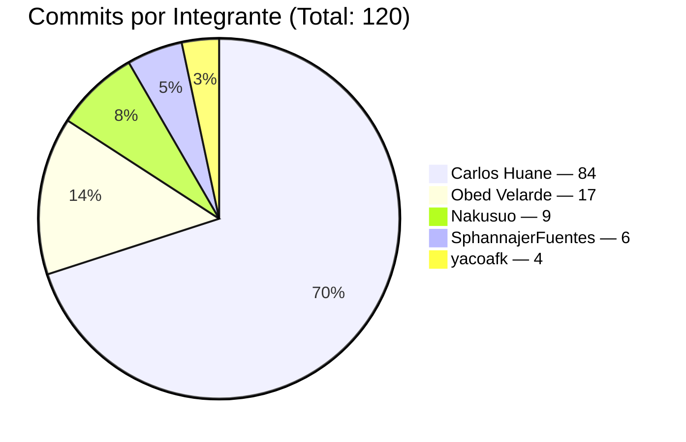
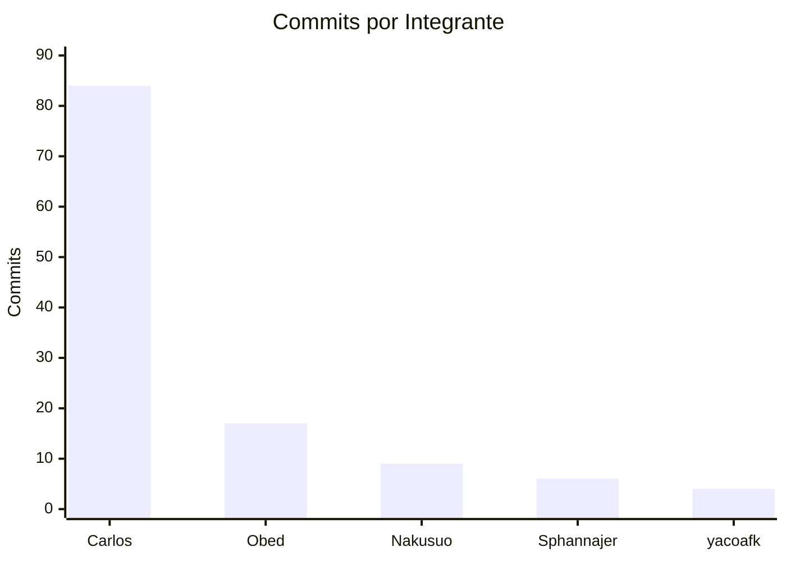
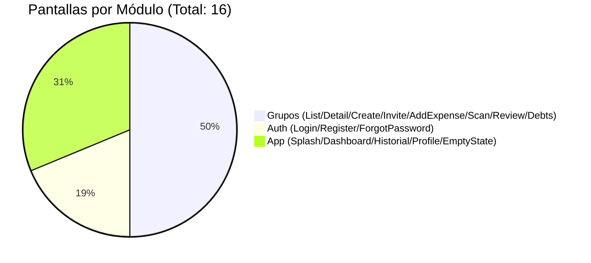
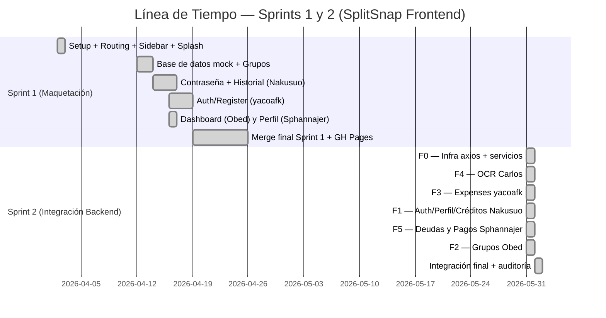

# SplitSnap — Frontend

> Aplicación web para dividir gastos entre grupos, construida en React + Vite.
> **Sprint 2 (junio 2026):** integrada al backend Spring Boot desplegado en Railway.

---

## Enlaces del Proyecto

| Recurso | Enlace |
|---------|--------|
| Diseño UI | [Figma — SplitSnap](https://www.figma.com/design/cQIWPo5Q8xUltYI0csHZ6q/Pencil-to-Figma-Importer--Comunidad-?node-id=1-1892&t=MDs1X9QVeJqjXc6H-1) |
| Product Backlog y Requerimientos | [Google Docs](https://docs.google.com/document/d/1zwfa7n6_puNALHguFup8Qa2poQH24fvr/edit?usp=sharing&ouid=115107241775214727274&rtpof=true&sd=true) |
| Gestión de Tareas | [Jira — SplitSnap](https://carloshuanesarmiento.atlassian.net/jira/software/projects/SCRUM/boards/1?atlOrigin=eyJpIjoiYzIyNjJjMTBlOTM4NGQ4MmI1YjdmZGU0YjMwMDUzYWMiLCJwIjoiaiJ9) |
| Repositorio Frontend | https://github.com/Carlos-Huane/SplitSnap-FrontEnd |
| Repositorio Backend | https://github.com/Carlos-Huane/SplitSnap-BackEnd |
| API en producción (Railway) | https://splitsnap-backend-production-7213.up.railway.app |
| Swagger UI | https://splitsnap-backend-production-7213.up.railway.app/swagger-ui/index.html |

---

## Tabla de Contenidos

1. [Descripción General](#1-descripción-general)
2. [Integrantes del Equipo](#2-integrantes-del-equipo)
3. [Stack Tecnológico](#3-stack-tecnológico)
4. [Estructura del Proyecto](#4-estructura-del-proyecto)
5. [Ramas (Branches)](#5-ramas-branches)
6. [Línea de Tiempo del Desarrollo](#6-línea-de-tiempo-del-desarrollo)
7. [Pull Requests Fusionados](#7-pull-requests-fusionados)
8. [Historial de Commits](#8-historial-de-commits)
9. [Arquitectura de la Aplicación](#9-arquitectura-de-la-aplicación)
10. [Rutas de la Aplicación](#10-rutas-de-la-aplicación)
11. [Conexión con el Backend](#11-conexión-con-el-backend)
12. [OCR de Recibos](#12-ocr-de-recibos)
13. [Convenciones del Proyecto](#13-convenciones-del-proyecto)
14. [Cómo Ejecutar el Proyecto](#14-cómo-ejecutar-el-proyecto)
15. [Despliegue](#15-despliegue)

---

## 1. Descripción General

**SplitSnap** es una aplicación frontend desarrollada en React que permite a grupos de personas dividir y gestionar gastos compartidos. Entre sus funcionalidades principales se encuentran:

- Autenticación de usuarios con JWT (login, registro, recuperación demo)
- Creación y gestión de grupos de gasto con búsqueda real de usuarios
- Escaneo de recibos mediante OCR (Google Cloud Vision)
- División de gastos entre miembros con validación lado-cliente y servidor
- Resumen de deudas por persona y por gasto
- Pago con créditos del sistema o marca manual (Yape / PayPal / Efectivo)
- Compra de créditos e historial de transacciones
- Dashboard con resumen del usuario
- Historial consolidado de movimientos
- Gestión de perfil con avatar persistente

### Estado de Sprints

| Sprint | Fechas | Foco | Estado |
|---|---|---|---|
| Sprint 1 | abril 2026 | Maquetación + datos mock en localStorage | ✅ Completado |
| Sprint 2 | mayo–junio 2026 | Integración con backend Spring Boot + Railway | ✅ Completado |

---

## 2. Integrantes del Equipo

| # | Nombre | GitHub | Rol (Sprint 2) | Commits |
|---|--------|--------|----------------|---------|
| 1 | **Carlos Huane** | `Carlos-Huane` | PM / Lead / F0 infra + F4 OCR + integración final | 84 |
| 2 | **Obed Velarde** | `Nakusuoo` / `U23225009` | F2 Grupos (CreateGroup, GroupList, InviteMembers) | 17 |
| 3 | **Nakusuo (Marcela)** | `Nakusuo` | F1 Auth + Perfil + Créditos | 9 |
| 4 | **SphannajerFuentes (Dafne)** | `SphannajerFuentes` | F5 Deudas y Pagos | 6 |
| 5 | **yacoafk (Yorma)** | `yacoafk` | F3 Detalle de Grupo + AddExpense | 4 |

**Total de commits en `develop`:** 120

### Distribución de commits por integrante


```mermaid
pie title Commits por Integrante (Total: 120)
    "Carlos Huane — 84" : 84
    "Obed Velarde — 17" : 17
    "Nakusuo — 9" : 9
    "SphannajerFuentes — 6" : 6
    "yacoafk — 4" : 4
```


```mermaid
xychart-beta
    title "Commits por Integrante"
    x-axis ["Carlos", "Obed", "Nakusuo", "Sphannajer", "yacoafk"]
    y-axis "Commits" 0 --> 90
    bar [84, 17, 9, 6, 4]
```

---

## 3. Stack Tecnológico

| Herramienta | Versión | Uso |
|-------------|---------|-----|
| React | ^19.2.4 | Librería de UI principal |
| React DOM | ^19.2.4 | Renderizado en el navegador |
| React Router DOM | ^7.13.2 | Enrutamiento SPA |
| Axios | ^1.16.1 | Cliente HTTP con interceptores JWT |
| Vite | ^8.0.1 | Bundler y servidor de desarrollo |
| ESLint | ^9.39.4 | Linter de código |

**Lenguaje:** JavaScript (JSX)
**Estilos:** CSS plano con variables CSS personalizadas (sin frameworks de UI)
**Persistencia local:** `localStorage` (token JWT bajo `splitsnap_token`, snapshot UI bajo `splitsnap_v1`)
**Cliente HTTP:** Axios centralizado en `src/services/api.js` con baseURL configurable

### Distribución de pantallas por módulo


```mermaid
pie title Pantallas por Módulo (Total: 16)
    "Grupos (List/Detail/Create/Invite/AddExpense/Scan/Review/Debts)" : 8
    "Auth (Login/Register/ForgotPassword)" : 3
    "App (Splash/Dashboard/Historial/Profile/EmptyState)" : 5
```

---

## 4. Estructura del Proyecto

```
splitsnap-frontend/
├── public/
├── docs/
│   └── demo-boletas/              # Boletas mock HTML para demo de OCR
│       ├── boleta-restaurant.html
│       ├── boleta-supermercado.html
│       ├── boleta-bodega.html
│       └── README.md
├── src/
│   ├── assets/
│   │
│   ├── components/
│   │   ├── dashboard/
│   │   └── shared/
│   │       ├── Sidebar.jsx        # Navegación lateral global
│   │       ├── RequireAuth.jsx    # Guard de rutas autenticadas
│   │       └── Sidebar.css
│   │
│   ├── context/
│   │   ├── AppContext.jsx         # Sesión + créditos + avatar
│   │   └── SidebarContext.jsx     # Apertura del sidebar móvil
│   │
│   ├── data/                      # Catálogos estáticos (emojis, tipos)
│   │   ├── auth.js / dashboard.js / global.js
│   │   ├── groups.js / historial.js / profile.js
│   │   └── index.js
│   │
│   ├── pages/                     # Una página = una carpeta = una ruta
│   │   ├── Splash/        Login/         Register/
│   │   ├── ForgotPassword/  Dashboard/   GroupList/
│   │   ├── CreateGroup/   InviteMembers/ GroupDetail/
│   │   ├── AddExpense/    ScanReceipt/   ReviewItems/
│   │   ├── DebtSummary/   Historial/     Profile/
│   │   └── EmptyState/
│   │
│   ├── services/                  # Cliente HTTP por dominio (Sprint 2)
│   │   ├── api.js                 # Axios + interceptores JWT + resolveAssetUrl
│   │   ├── auth.service.js
│   │   ├── users.service.js
│   │   ├── groups.service.js
│   │   ├── expenses.service.js
│   │   ├── debts.service.js
│   │   ├── credits.service.js
│   │   └── transactions.service.js
│   │
│   ├── styles/
│   │   ├── variables.css
│   │   ├── global.css
│   │   └── dashboard.css
│   │
│   ├── App.jsx                    # Árbol de rutas
│   ├── main.jsx
│   └── index.css
│
├── .env.example                   # Plantilla con VITE_API_URL
├── README.md
├── package.json
├── vite.config.js
└── eslint.config.js
```

---

## 5. Ramas (Branches)

### Sprint 2 — Integración con backend (mayo–junio 2026)

| Rama | Responsable | Propósito | PR |
|------|-------------|-----------|----|
| `feature/F0-infra-shared` | Carlos | Axios + servicios por dominio + JWT interceptor | #26 |
| `feature/F4-ocr` | Carlos | Pantalla scan + review conectada al OCR del backend | #27 |
| `docs/guia-integracion-equipo` | Carlos | Guía para el equipo + .env.example a Railway | #28, #29 |
| `feature/F3-expenses-restored` | yacoafk | AddExpense + GroupDetail integrados | #30 |
| `feature/F1-auth-register-login` | Nakusuo | Login, Register, Perfil, Créditos | #31 |
| `feature/deudasypagos` | SphannajerFuentes | DebtSummary, mark-paid, pay-credits | #32 |
| `feature/F2-Grupos` | Obed | GroupList, CreateGroup, InviteMembers, UX | #33 |
| `fix/correciones-integracion` | Carlos | Auditoría completa + fixes finales + Historial real | #34 |

### Sprint 1 — Maquetación con mocks (abril 2026)

| Rama | Responsable | Propósito | PR |
|------|-------------|-----------|----|
| `feature/project-setup` | Carlos | Estructura inicial + variables CSS | #1 |
| `feature/routing` | Carlos | React Router + placeholders | #2 |
| `feature/sidebar` | Carlos | Sidebar global | #3 |
| `feature/splash-screen` | Carlos | Splash con animación | #4 |
| `design/diseño-mejorado` | Carlos | Login + diseño general | #5 |
| `feature/breve-documentacion` | Carlos | Documentación inicial | #6 |
| `feature/base-datos-local-js` | Carlos | Capa de mocks | #7 |
| `feature/groups-section` | Carlos | 8 pantallas del módulo de grupos | #8 |
| `feature/contraseña-section` | Nakusuo | Recuperación de contraseña | #10 |
| `feature/historial-section` | Nakusuo | Sección Historial | #11 |
| `feature/register` | yacoafk | Registro/login con credenciales locales | #14 |
| `feature/perfil-section` | SphannajerFuentes | Perfil de usuario | #15 |
| `feature/dashboard` | Obed | Dashboard responsive | #16 |
| `feat/añadir-documentacion` | Carlos | README detallado v1 | #17 |
| `fix/logica-incompleta` | Carlos | Refactor de pages + créditos + sesión | #18 |
| `feat/configuracion-deploy` | Carlos | GitHub Pages | #20 |
| `feature/readme-naming` | Carlos | Convención `feature/` | #22 |
| `hotfix/sidebar-mobile-fix` | Carlos | Botón hamburguesa global | #24 |

**Ramas vivas hoy:** `main`, `develop`, `docs/readme-completo` (esta).
**Total de PRs cerrados:** 30+.

---

## 6. Línea de Tiempo del Desarrollo


```mermaid
gantt
    title Línea de Tiempo — Sprints 1 y 2 (SplitSnap Frontend)
    dateFormat  YYYY-MM-DD

    section Sprint 1 (Maquetación)
    Setup + Routing + Sidebar + Splash      :done, 2026-04-02, 1d
    Base de datos mock + Grupos             :done, 2026-04-12, 2d
    Contraseña + Historial (Nakusuo)        :done, 2026-04-14, 3d
    Auth/Register (yacoafk)                 :done, 2026-04-16, 3d
    Dashboard (Obed) y Perfil (Sphannajer)  :done, 2026-04-16, 1d
    Merge final Sprint 1 + GH Pages         :done, 2026-04-19, 7d

    section Sprint 2 (Integración Backend)
    F0 — Infra axios + servicios            :done, 2026-05-31, 1d
    F4 — OCR Carlos                         :done, 2026-05-31, 1d
    F3 — Expenses yacoafk                   :done, 2026-05-31, 1d
    F1 — Auth/Perfil/Créditos Nakusuo       :done, 2026-05-31, 1d
    F5 — Deudas y Pagos Sphannajer          :done, 2026-05-31, 1d
    F2 — Grupos Obed                        :done, 2026-05-31, 1d
    Integración final + auditoría           :done, 2026-06-01, 1d
```

---

## 7. Pull Requests Fusionados

### Sprint 2

| PR | Rama origen | Fecha | Descripción |
|----|-------------|-------|-------------|
| #26 | `feature/F0-infra-shared` | 2026-05-31 | Axios + JWT + servicios por dominio |
| #27 | `feature/F4-ocr` | 2026-05-31 | OCR de recibos conectado al backend |
| #28 | `docs/guia-integracion-equipo` | 2026-05-31 | `.env.example` con URL real de Railway |
| #29 | `docs/guia-integracion-equipo` | 2026-05-31 | Default API URL apuntando a Railway |
| #30 | `feature/F3-expenses-restored` | 2026-05-31 | AddExpense + GroupDetail con historial limpio |
| #31 | `feature/F1-auth-register-login` | 2026-05-31 | F1.1–F1.4 — Auth, Perfil, Créditos |
| #32 | `feature/deudasypagos` | 2026-05-31 | F5.1–F5.3 — Resumen, marca manual, pago con créditos |
| #33 | `feature/F2-Grupos` | 2026-05-31 | F2.1–F2.3 — Listar, crear, invitar |
| #34 | `fix/correciones-integracion` | 2026-06-01 | Unifica consumo de endpoints reales del backend |

### Sprint 1

| PR | Rama origen | Fecha | Descripción |
|----|-------------|-------|-------------|
| #1 | `feature/project-setup` | 2026-04-02 | Configuración inicial |
| #2 | `feature/routing` | 2026-04-02 | React Router + placeholders |
| #3 | `feature/sidebar` | 2026-04-02 | Sidebar global |
| #4 | `feature/splash-screen` | 2026-04-02 | Splash |
| #5 | `design/diseño-mejorado` | 2026-04-02 | Login + diseño general |
| #6 | `feature/breve-documentacion` | 2026-04-02 | Documentación inicial |
| #7 | `feature/base-datos-local-js` | 2026-04-12 | Mocks |
| #8 | `feature/groups-section` | 2026-04-13 | 8 pantallas del módulo de grupos |
| #10 | `feature/contraseña-section` | 2026-04-16 | Recuperación de contraseña |
| #11 | `feature/historial-section` | 2026-04-16 | Historial |
| #14 | `feature/register` | 2026-04-19 | Registro/login local |
| #15 | `feature/perfil-section` | 2026-04-16 | Perfil |
| #16 | `feature/dashboard` | 2026-04-19 | Dashboard |
| #17 | `feat/añadir-documentacion` | 2026-04-25 | README detallado v1 |
| #18 | `fix/logica-incompleta` | 2026-04-26 | Refactor: pages organizadas, créditos, sesión |
| #20 | `feat/configuracion-deploy` | 2026-04-26 | Deploy GitHub Pages |
| #22 | `feature/readme-naming` | 2026-04-26 | Convención `feature/` |
| #24 | `hotfix/sidebar-mobile-fix` | 2026-04-26 | Botón hamburguesa global |

---

## 8. Historial de Commits (resumen Sprint 2)

| Hash | Autor | Fecha | Mensaje |
|------|-------|-------|---------|
| `24b84c5` | Carlos | 2026-06-01 | Merge PR #34 fix/correciones-integracion |
| `b83729c` | Carlos | 2026-06-01 | fix(integracion): unificar consumo de endpoints reales del backend |
| `8ba651b` | Obed | 2026-05-31 | Merge PR #33 feature/F2-Grupos |
| `6e21431` | Obed | 2026-05-31 | feat(groups): mostrar cantidad de miembros en detalle |
| `7ae627b` | Sphannajer | 2026-05-31 | Implementando pagos con creditos HU-F5.3 |
| `120e9e5` | Obed | 2026-05-31 | feat(groups): agregar limite y contador para nombre de grupo |
| `7932630` | Sphannajer | 2026-05-31 | Implementando marcar como pagadas HU-F5.2 |
| `5ae7172` | Obed | 2026-05-31 | feat(groups): mostrar totales con dos decimales |
| `4d9ae5b` | Sphannajer | 2026-05-31 | Implementando resumen de deudas HU-F5.1 |
| `f6f0786` | Obed | 2026-05-31 | refactor(groups): ordenar grupos alfabeticamente |
| `1a8ae9b` | Obed | 2026-05-31 | feat(groups): mostrar cantidad total de grupos |
| `95fed1c` | Nakusuo | 2026-05-31 | feat: F1.4 implement credit system (view & purchase) |
| `3c00ee7` | Nakusuo | 2026-05-31 | feat: F1.3 implement user profile (get, edit, avatar upload) |
| `d331156` | Nakusuo | 2026-05-31 | feat: F1.1-F1.2 implement user authentication |
| `5cd7ab5` | yacoafk | 2026-05-31 | feat: diseño y lógica de AddExpense y GroupDetail |
| `620dc9c` | Carlos | 2026-05-31 | feat(api): apuntar por default al backend de Railway |
| `f291f10` | Carlos | 2026-05-31 | feat(F4): OCR de recibos conectado al backend |
| `36ff0a3` | Carlos | 2026-05-31 | feat(F0): infraestructura compartida con axios, JWT y servicios |

> Historial completo de Sprint 1 disponible en `git log --all` o en GitHub.

---

## 9. Arquitectura de la Aplicación

### Capas

```
┌─────────────────────────────────────────────────────────┐
│   pages/  ←  Páginas React (una por ruta)               │
│      ↓                                                  │
│   services/  ← Cliente HTTP por dominio (axios)         │
│      ↓                                                  │
│   services/api.js  ← Axios + interceptores JWT/errores  │
│      ↓                                                  │
│   Backend Spring Boot en Railway                        │
└─────────────────────────────────────────────────────────┘

context/AppContext      → sesión, currentUser, créditos, avatar (persistido en localStorage)
context/SidebarContext  → estado de apertura del sidebar móvil
components/shared/RequireAuth → guard de rutas autenticadas
```

### Cliente HTTP — `src/services/api.js`

- `baseURL`: `import.meta.env.VITE_API_URL` con fallback al backend de Railway.
- **Interceptor request**: inyecta `Authorization: Bearer <token>` si hay token en `localStorage`.
- **Interceptor response**:
  - 401 → `clearToken()` + dispatch evento `auth:expired` → AppContext hace LOGOUT y redirige a `/login`.
  - Sin response (red caída) → dispatch evento `app:network-error`.
- **`extractErrorMessage(err, fallback)`**: prioriza `err.response.data.message` (formato estándar del backend).
- **`resolveAssetUrl(path)`**: compone URLs absolutas para los avatares que el backend devuelve como `/uploads/avatars/...` (relativos).

### Gestión de Estado Global — `AppContext`

| Acción | Descripción |
|---|---|
| `LOGIN` | Persiste token, hace upsert del usuario, setea `currentUserId` |
| `REGISTER_USER` | Igual que LOGIN pero post-registro |
| `LOGOUT` | Limpia token y `currentUserId` |
| `SET_AVATAR` | Actualiza el avatar en el contexto |
| `UPDATE_PROFILE` | Sobrescribe campos del usuario actual |

> Persistencia automática vía `useEffect` → `localStorage.setItem('splitsnap_v1', ...)`. El token JWT vive aparte en `localStorage['splitsnap_token']`.

### Árbol de Providers

```jsx
<AppProvider>
  <SidebarProvider>
    <AppRoutes />
  </SidebarProvider>
</AppProvider>
```

---

## 10. Rutas de la Aplicación

| Ruta | Componente | Sidebar | Auth |
|------|-----------|---------|------|
| `/` | `Splash` | No | No |
| `/login` | `Login` | No | No |
| `/register` | `Register` | No | No |
| `/forgot-password` | `ForgotPassword` | No | No |
| `/dashboard` | `Dashboard` | Sí | ✅ |
| `/groups` | `GroupList` | Sí | ✅ |
| `/groups/new` | `CreateGroup` | Sí | ✅ |
| `/groups/:id` | `GroupDetail` | Sí | ✅ |
| `/groups/:id/invite` | `InviteMembers` | Sí | ✅ |
| `/groups/:id/add-expense` | `AddExpense` | Sí | ✅ |
| `/groups/:id/scan` | `ScanReceipt` | Sí | ✅ |
| `/groups/:id/scan/review` | `ReviewItems` | Sí | ✅ |
| `/groups/:id/debts` | `DebtSummary` | Sí | ✅ |
| `/historial` | `Historial` | Sí | ✅ |
| `/profile` | `Profile` | Sí | ✅ |
| `/empty` | `EmptyState` | Sí | ✅ |

---

## 11. Conexión con el Backend

Todo el código de red vive en `src/services/`. Una página típica importa el servicio del dominio y delega request + manejo de error.

### Servicios por dominio

| Servicio | Endpoints cubiertos |
|---|---|
| `auth.service.js` | `POST /api/auth/{register,login}`, decode/validate JWT |
| `users.service.js` | `GET/PUT /api/users/me`, `PUT /me/avatar`, `GET /api/users/search?q=` |
| `groups.service.js` | `GET/POST /api/groups`, `GET /api/groups/:id`, `POST/DELETE /api/groups/:id/members[/:userId]` |
| `expenses.service.js` | `GET/POST /api/groups/:id/expenses`, `GET /api/groups/:id/expenses/:expId`, `POST /api/ocr/scan` |
| `debts.service.js` | `GET /api/groups/:id/debts?status=`, `PUT /:debtId/{mark-paid,pay-credits}` |
| `credits.service.js` | `GET /api/users/me/credits`, `POST /api/users/me/credits/buy` |
| `transactions.service.js` | `GET /api/users/me/transactions?groupId=&type=` |

### Variables de entorno

Copia `.env.example` a `.env`:

```bash
# Backend local
VITE_API_URL=http://localhost:8080

# Backend en producción (Railway)
VITE_API_URL=https://splitsnap-backend-production-7213.up.railway.app
```

### Credenciales de prueba (semilladas en el backend)

| Email | Password |
|---|---|
| `carlos@splitsnap.com` | `test123` |
| `ana@splitsnap.com` | `test123` |
| `juan@splitsnap.com` | `test123` |

### Mapeo de errores del backend → UI

| HTTP | Causa típica | Manejo en el front |
|------|---|---|
| 400 | Validación de DTO, "ya es miembro", "email en uso", "créditos insuficientes" | Mensaje legible del backend vía `extractErrorMessage` |
| 401 | Token inválido o expirado | Auto-logout + redirect `/login` |
| 403 | No es miembro / no es deudor | Banner amigable según contexto |
| 404 | Grupo/gasto no encontrado | "No encontramos lo que buscas" |
| 409 | Deuda ya pagada | Refresh de la lista + alerta |

---

## 12. OCR de Recibos

La pantalla `/groups/:id/scan` permite escanear un ticket. El backend usa **Google Cloud Vision API** y devuelve:

```json
{
  "description": "Escaneo: <primera línea del recibo>",
  "detectedAmount": 162.00,
  "confidenceScore": "precio venta",
  "extractedItems": ["línea 1", "línea 2", "..."]
}
```

### Keywords reconocidas (HU-F4.5)

El backend busca el monto total con prioridad:

1. `PRECIO VENTA` (SUNAT)
2. `TOTAL A PAGAR`
3. `POR PAGAR` / `GRAN TOTAL`
4. `TOTAL` / `MONTO TOTAL` / `IMPORTE TOTAL`
5. `VALOR VENTA` / `IMPORTE`
6. `NETO` / `PAGO`
7. `SUBTOTAL` / `OP. GRAVADAS` (último recurso)

### Fallback presentacional

Si `detectedAmount === 0`, `ReviewItems` muestra un banner ámbar y deja el input vacío para que el usuario tipee el monto manualmente. El flujo continúa sin interrupción.

### Boletas mock para demo

`docs/demo-boletas/` contiene 3 HTMLs estilo SUNAT (restaurant, supermercado, bodega) con keywords distintas. Útiles como plan B en la exposición si una boleta real no es leída bien por el OCR.

---

## 13. Convenciones del Proyecto

### Ramas

```
main              → producción estable (despliegue automático)
develop           → integración del equipo
feature/<nombre>  → nueva funcionalidad
fix/<nombre>      → corrección de errores
docs/<nombre>     → cambios solo en documentación
hotfix/<nombre>   → arreglos urgentes a producción
chore/<nombre>    → configuración, dependencias
```

### Commits (Conventional Commits)

```
feat:     nueva funcionalidad
fix:      corrección de bug
refactor: reestructuración sin cambio de comportamiento
docs:     solo documentación
chore:    tareas de mantenimiento (config, deps)
```

### Estructura de archivos de página

Cada página vive en su propia carpeta `src/pages/NombrePagina/` con su `NombrePagina.jsx`, `NombrePagina.css` e `index.js` que re-exporta el componente.

---

## 14. Cómo Ejecutar el Proyecto

### Requisitos previos

- Node.js >= 18
- npm >= 9

### Instalación

```bash
git clone https://github.com/Carlos-Huane/SplitSnap-FrontEnd.git
cd SplitSnap-FrontEnd
npm install
cp .env.example .env   # o "copy" en Windows
```

### Comandos disponibles

```bash
npm run dev       # Servidor de desarrollo en http://localhost:5173
npm run build     # Build de producción en /dist
npm run preview   # Preview del build
npm run lint      # ESLint
```

---

## 15. Despliegue

### Vercel (recomendado)

1. **Conectar repo:** [vercel.com/new](https://vercel.com/new) → importar `SplitSnap-FrontEnd`.
2. **Framework Preset:** Vite (autodetectado).
3. **Build command:** `npm run build` (default).
4. **Output directory:** `dist` (default).
5. **Environment Variables:**
   - `VITE_API_URL` = `https://splitsnap-backend-production-7213.up.railway.app`
6. **Deploy.** Vercel construye y publica en `https://<tu-proyecto>.vercel.app`.

Cada push a `main` redespliega automáticamente. Las pull requests reciben previews aisladas con su propia URL.

Después del primer deploy, hay que **agregar el dominio Vercel** a la variable `CORS_ORIGINS` del backend en Railway (sino, las requests fallan por CORS).

### Alternativas gratis

| Plataforma | Pro | Contra |
|---|---|---|
| Vercel | Setup en 3 min, edge network global, free 100 GB/mes | — |
| Netlify | Equivalente a Vercel | UI un poco menos pulida |
| Cloudflare Pages | Free tier ilimitado en bandwidth | Setup levemente más manual |
| GitHub Pages | Gratis con la cuenta | No maneja SPA bien sin `404.html` workaround |

### Caja de testing

El backend ya está desplegado en Railway, así que basta con apuntar `VITE_API_URL` a esa URL y hacer login con `carlos@splitsnap.com / test123` para validar el deploy end-to-end.

---

*Documentación actualizada el 2026-06-01 — Rama: `docs/readme-completo`*
